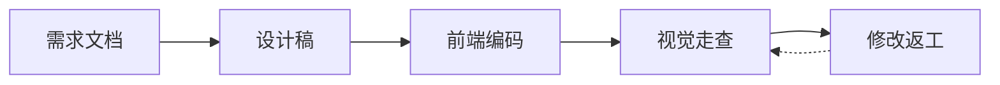
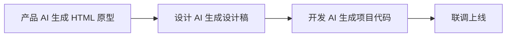
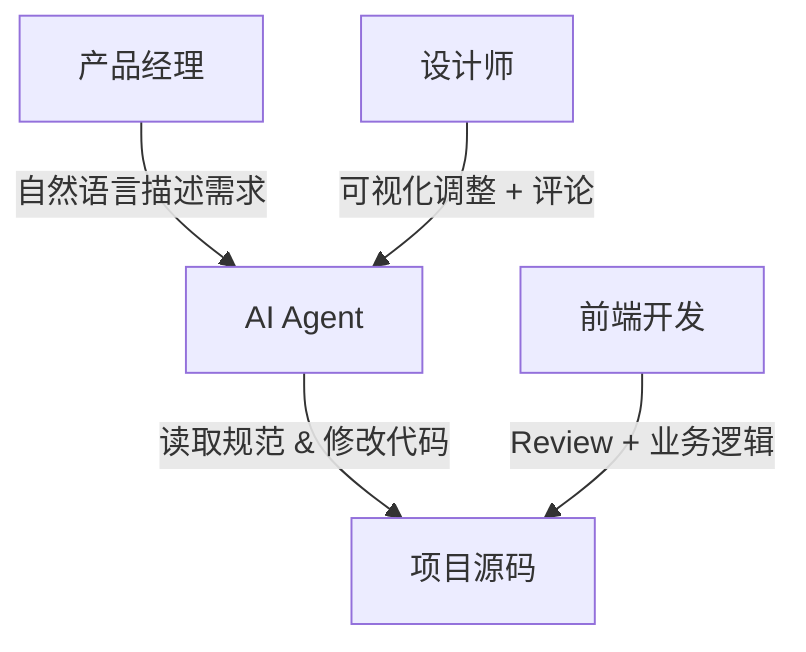
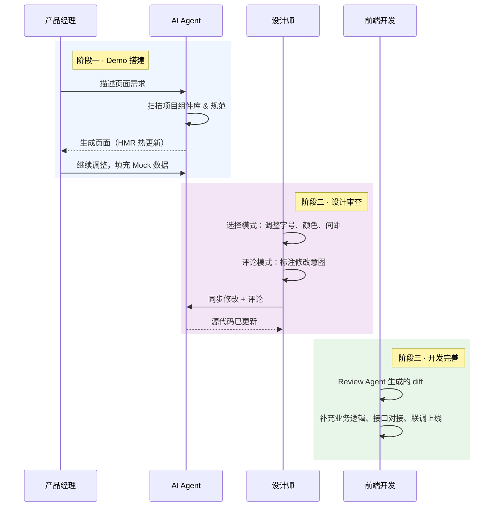
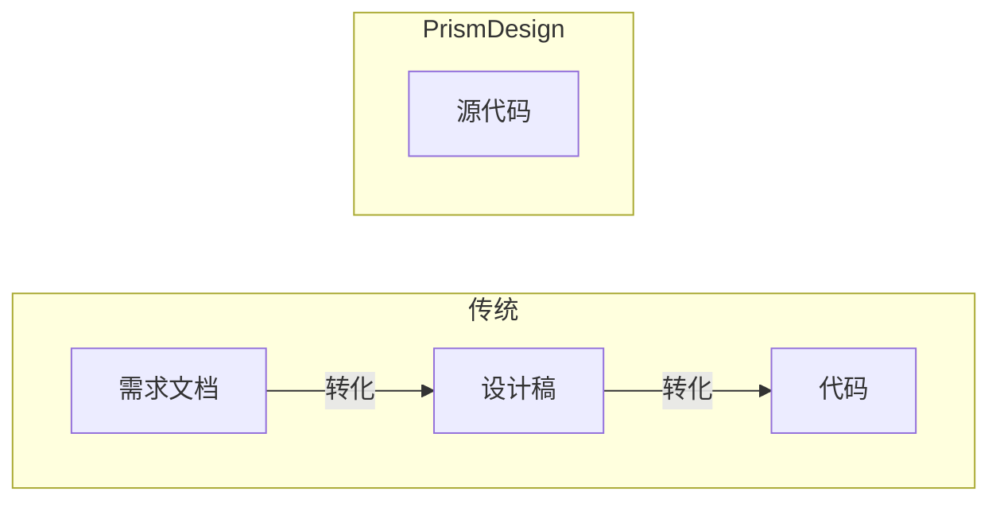

# PrismDesign 产品说明

> 面向业务团队的 AI 驱动可视化开发工具 —— 让需求直接生长在代码之上

---

## 一、产品定位

PrismDesign 是一款 Chrome 浏览器插件 + AI Agent 的组合工具。它允许产品经理、设计师在**运行中的前端项目源码**之上，通过可视化操作和自然语言指令，直接完成页面 Demo 的搭建与视觉调整，由 AI Agent 将操作同步为高质量的工程代码。

核心理念：**代码即设计稿，设计稿即代码**。

---

## 二、研发流程对比

### 2.1 传统研发流程

**痛点：**

- **串行流程**：每个环节必须等待上一环节完成，周期长
- **产出物断裂**：需求文档、设计稿、代码三者各自独立，每次交接都是信息损耗
- **视觉还原难**：实际效果与设计稿总有偏差，反复走查调整
- **沟通成本高**：间距、颜色、字号需要逐一标注核对

### 2.2 各角色独立使用 AI（当前行业现状）

同一个页面被 AI 生成了**三遍**，每次都从零开始。

**痛点：**

- **重复劳动**：三个角色各自用 AI 生成一份独立产物，无法复用
- **上下文丢失**：无法继承项目已有的组件库、设计规范和技术栈
- **质量不可控**：AI 生成的代码不符合项目规范，开发仍需大量改写
- **沟通问题依旧**：交接环节的返工成本并未减少

### 2.3 PrismDesign 工作流

**核心变化：所有人在同一份代码上协作，AI Agent 是执行者。**

---

## 三、各角色工作流详解

### 3.1 产品经理

| 步骤 | 操作 | 产出 |
|------|------|------|
| 1 | 在对话窗口用自然语言描述页面需求 | Agent 生成页面代码 |
| 2 | 预览效果，继续对话调整布局、内容 | 实时更新的页面 |
| 3 | 使用 Mock 数据填充业务场景 | 可演示的 Demo |
| 4 | 确认后通知设计师进行视觉审查 | 可用的页面 Demo |

**与传统流程的区别：** 不再需要写 PRD 描述页面长什么样，直接用自然语言让 AI 搭出来，所见即所得。

### 3.2 设计师

| 步骤 | 操作 | 产出 |
|------|------|------|
| 1 | 打开 Demo 页面，进入选择模式 | 查看元素属性 |
| 2 | 直接调整颜色、字号、间距、圆角等 | 实时预览效果 |
| 3 | 对需要修改的元素添加评论标注 | 待同步消息 |
| 4 | 点击「同步」将修改和评论发送给 Agent | Agent 修改源代码 |

**与传统流程的区别：** 不再需要出设计稿再交付开发还原，直接在真实页面上调整。告别视觉走查。

### 3.3 前端开发

| 步骤 | 操作 | 产出 |
|------|------|------|
| 1 | Review Agent 生成的代码（Git diff） | 确认代码质量 |
| 2 | 补充业务逻辑、状态管理、接口对接 | 完整功能代码 |
| 3 | 前后端联调 | 可上线功能 |

**与传统流程的区别：** 不再从零编码页面 UI，拿到的是符合项目规范的代码骨架，只需关注业务逻辑。

### 3.4 后端开发

| 步骤 | 操作 | 说明 |
|------|------|------|
| 1 | 正常进行数据库和接口设计 | 不受影响 |
| 2 | 前端 Demo 阶段使用 Mock 数据 | 前后端解耦开发 |
| 3 | 接口就绪后进行联调 | 对接真实数据 |

**与传统流程的区别：** 前端 Demo 不再依赖接口就绪，双方可并行开发。

---

## 四、端到端协作流程

---

## 五、核心优势

### 5.1 第一性原理：代码是唯一产出物

不再有中间产物。产品的需求、设计的视觉、开发的代码，全部收敛到同一份源代码上。

### 5.2 AI Agent 的项目感知能力

Agent 启动时自动扫描项目，获取：

| 维度 | 示例 | 作用 |
|------|------|------|
| 技术框架 | React / Vue / Next.js | 生成框架特定代码 |
| 样式方案 | Tailwind / CSS Modules | 遵循项目样式约定 |
| 组件库 | Ant Design / 业务组件 | 优先复用已有组件 |
| 设计规范 | Token / 主题变量 | 确保视觉一致性 |

生成的代码**天然符合项目规范**，不是脱离上下文的通用代码。

### 5.3 可视化选中：精准定位，降低描述成本

传统方式下，用户需要用自然语言描述"页面中间那个蓝色按钮"，模型要猜测指的是哪个元素，沟通效率低且容易出错。

PrismDesign 的选中 + 评论机制彻底解决了这个问题：

- **选中即定位**：用户点击元素后，插件自动采集组件名、源码文件路径、行号、DOM 路径等完整信息，Agent 能精确知道要修改哪个组件的哪一行代码
- **修改即指令**：用户直接调整字号、颜色等属性值，Agent 收到的是精确的 `fontSize: 14px → 16px`，无需理解模糊描述
- **评论即补充**：当可视化编辑无法覆盖的需求（如"这个列表要支持拖拽排序"），可以对着具体元素写评论，比脱离上下文的文字描述更高效

### 5.4 版本可控：基于 Git 的完整追溯能力

因为所有修改都直接作用于项目源码，而源码本身托管在 Git 仓库，天然具备完整的版本管理能力：

- **每次修改可追溯**：Agent 的每一次代码变更都体现在 Git diff 中，谁改了什么、什么时候改的，一目了然
- **分支管理**：可以为不同需求创建独立分支，产品经理在 feature-A 分支搭建 Demo，设计师在同一分支调整视觉，互不干扰
- **随时回滚**：如果某次 AI 修改不理想，`git revert` 即可回退，不存在"改坏了回不去"的风险
- **Code Review 天然集成**：前端开发通过 Pull Request 审查 Agent 生成的代码，和现有研发流程无缝衔接

相比之下，传统设计稿和 HTML 原型没有版本管理，改了就改了，无法追溯和回滚。

### 5.5 效率提升

| 环节 | 传统流程 | PrismDesign | 节省 |
|------|---------|-------------|------|
| 需求→Demo | 3-5 天 | 0.5-1 天 | ~80% |
| 视觉走查 | 1-2 天 | 实时生效 | ~90% |
| 设计→代码 | 需单独还原 | 已经是代码 | 100% |
| 沟通确认 | 多轮会议 | 页面上标注 | ~70% |

---

## 六、插件功能说明

### 6.1 浮动工具栏

| 模式 | 快捷键 | 功能 |
|------|--------|------|
| 选择模式 | `Ctrl+Shift+E` | 选中元素，查看和编辑属性 |
| 拖拽模式 | `Ctrl+Shift+D` | 拖拽调整元素排列顺序 |
| 评论模式 | `Ctrl+Shift+C` | 点击元素添加文字评论 |

### 6.2 侧边面板

| 面板 | 功能 |
|------|------|
| 对话 | 与 AI Agent 自然语言交流，描述需求 |
| 导航 | DOM 树浏览，快速定位页面元素 |
| 属性 | 查看和编辑选中元素的样式属性 |
| 待同步 | 查看所有待发送的修改和评论 |

### 6.3 属性编辑

选中元素后可直接编辑：

- **文字**：字号、字重、颜色
- **填充**：背景色、透明度
- **外观**：圆角
- **布局**：间隔（Flex 容器）

所有修改实时预览，并自动记录为待同步消息，包含修改前后的值对比。

### 6.4 AI Agent 处理过程

发送消息后，侧边面板实时展示 Agent 的处理进度：

- 搜索文件、读取代码、编辑文件等操作步骤
- 处理完成后展示修改结果摘要
- 页面通过 HMR 自动热更新，无需手动刷新

---

## 七、技术要求

| 项目 | 要求 |
|------|------|
| 浏览器 | Chrome 116+ |
| 前端项目 | React / Vue（需支持 HMR） |
| Node.js | ≥ 18 |
| Agent 服务 | 本地或局域网运行 |

---

## 八、总结

PrismDesign 的核心价值不是"让每个人都能用 AI 写代码"，而是**消除研发流程中的信息转化损耗**。

当需求、设计、开发都在同一份源代码上进行时：

- 不再需要"需求文档→设计稿→代码"的三次转化
- 不再需要"视觉走查→标注→修改→再走查"的循环
- 不再需要"这个间距是多少？""这个颜色对吗？"的反复确认

**一份代码，从需求到上线，所有人看到的都是同一个东西。**
